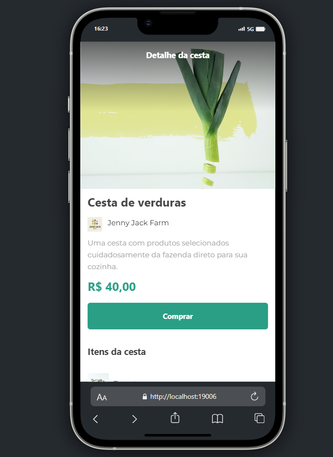

# Cesta 

App criado com afinalidade de poder aprender um pouco sobre React Native, utilizando algumas tecnicas de React, o Prendizado foi feito durante um curso da Alura.

| :placard: Vitrine.Dev |     |
| -------------  | --- |
| :sparkles: Nome        | **App Cesta**
| :label: Tecnologias | React Native, React

<!-- Inserir imagem com a #vitrinedev ao final do link -->


## Rodando localmente

Clone o projeto

```bash
  git clone https://github.com/AlbericoJr/Cesta_Frutas
```

Entre no diretório do projeto

```bash
  cd my-project
```

Instale as dependências

```bash
  npm install
``

Inicie o servidor

  npm start

